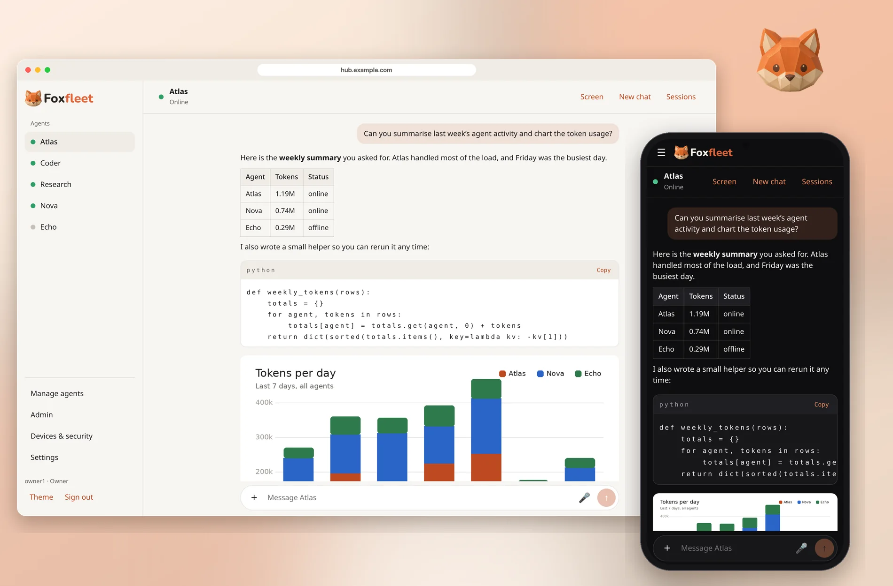
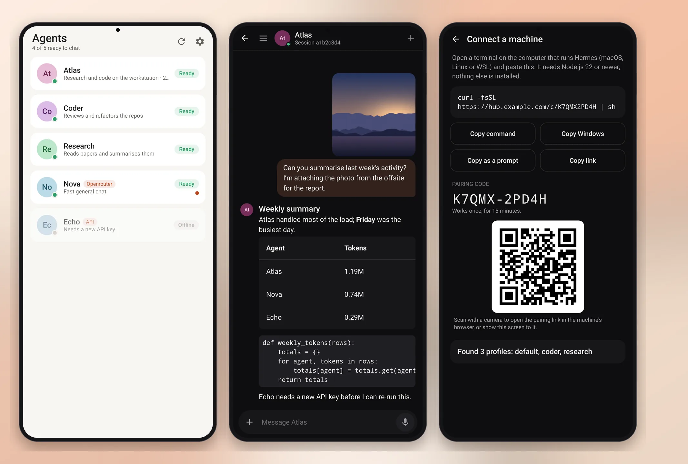
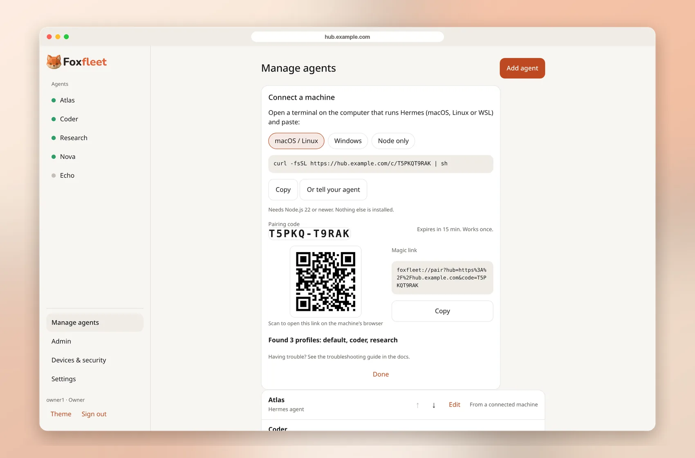
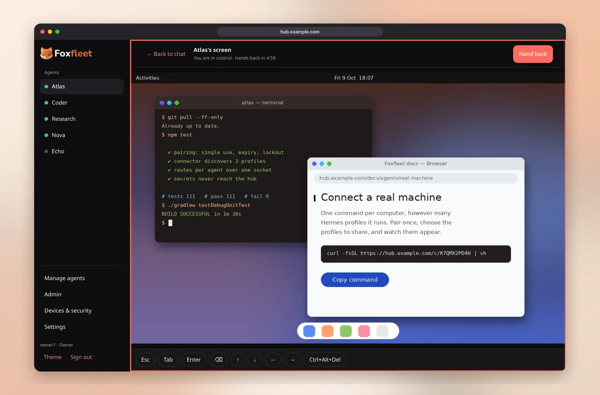
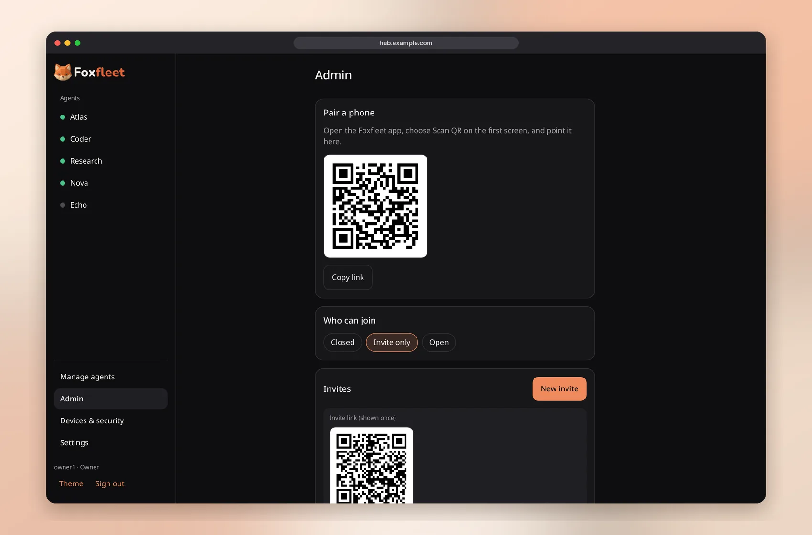
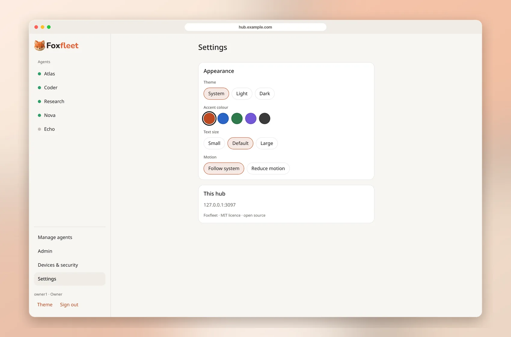
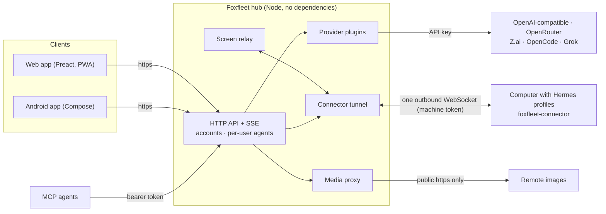

<p align="center">
  <picture>
    <source media="(prefers-color-scheme: dark)" srcset="design/brand/wordmark-dark.png">
    
  </picture>
</p>

<p align="center"><b>A universal hub for all your AI agents: web + Android, self-hosted.</b></p>

<p align="center">
  <a href="https://tinkerdoge.github.io/FoxFleet/"></a>
  <a href="LICENSE"></a>
</p>

<p align="center">
  <b><a href="https://tinkerdoge.github.io/FoxFleet/">Documentation</a></b> · <a href="https://github.com/TinkerDoge/FoxFleet/releases">Releases</a> · <a href="LICENSE">MIT</a> · <a href="docs/INSTALL.md">Install</a> · <a href="docs/CONNECT-AGENT.md">Connect an agent</a> · <a href="docs/ARCHITECTURE.md">Architecture</a> · <a href="docs/roadmap.html">Roadmap</a>
</p>

Foxfleet puts the agents you run on your own machines and the chat APIs you pay for in **one calm place**. You run a small hub
on a box you control; you talk to every agent from a browser or from the Android app, with real accounts, and your API keys and
machine addresses never leave the hub.

> **Status: alpha (0.1.x).** Everything below exists in this repository and is covered by automated tests, but it has had very little
> real-world use. Not yet verified: the **Docker image build** (no Docker was available when this was written), the **Android app on
> physical devices** and the `foxfleet://connect` deep link, and a **screen-reader pass** of the web app. See [Known limits](#known-limits).

<p align="center">
  
</p>

## Features

- **One hub, many agents.** Add, edit, reorder and remove agents from forms the hub describes itself (`/api/agent-kinds`), with *Test connection* and write-only secret fields ("saved on the hub, leave blank to keep").
- **Chat that streams.** Server-sent events, Markdown (tables, code with copy button, safe links), collapsible reasoning, tool/status line, `/` commands and `#` skills autocomplete.
- **Images and files.** Camera/gallery or drag-and-drop/paste; images are downscaled in the client (~2.5 MB budget); files upload with progress straight to the agent's machine. Remote images in replies are fetched by the hub through an SSRF-checked proxy, never by your browser.
- **Voice input** on the web where the browser offers the Web Speech API (button hidden otherwise) and in the Android app.
- **Screen takeover.** Watch an agent's virtual desktop (noVNC), *Take over*, then *Hand back* — with a countdown, a red border while you are in control, auto hand-back when you leave, and single-use tickets. Works for Hermes agents, including through the outbound connector.
- **Real accounts.** First-run owner setup, scrypt-hashed passwords, optional invites or open registration, per-user agents and secrets, a device list with revoke, change password, sign out everywhere, rate limiting and lockout.
- **No hard-coded hosts.** Both apps ask for your hub address on first launch (type it, scan the pairing QR, or open a `foxfleet://connect?hub=…` link) and can remember several hubs.
- **Pairing QR and invites** in the web Admin page and the in-app Admin screen (owner only).
- **Installable web app (PWA)** with an app-shell-only service worker and an explicit "new version, reload" prompt. Nothing from `/api` is ever cached.
- **Shared design.** One `design/tokens.json` generates the web CSS and the Android theme; light/dark, five accents, text size and reduced-motion settings.

### Android

<p align="center">
  
</p>

### Web

<table>
  <tr>
    <td></td>
    <td></td>
  </tr>
  <tr>
    <td></td>
    <td></td>
  </tr>
</table>

<sub>Screenshots are taken from the real apps with demo data (<code>design/tools/make-readme-images.py</code> rebuilds them). The demo hub, agents and chats are made up; the mascot and brand artwork are © Shibe De Doge.</sub>

## Supported agents

| Type | How it connects | Auth | Chat | Images | Files | Screen | Voice | Skills / sessions |
| --- | --- | --- | :-: | :-: | :-: | :-: | :-: | :-: |
| **Hermes agent** | One **machine connector** per computer (default, pair with one command), or direct host/port | machine token / dashboard credentials | ✅ | ✅ | ✅ | ✅ | ✅ | ✅ |
| **OpenAI-compatible** (any `/chat/completions` API, local models) | Hub calls the API | API key | ✅ | ✅ | – | – | – | – |
| **OpenRouter** | Hub calls the API | API key | ✅ | ✅ | – | – | – | – |
| **Z.ai (GLM)** | Hub calls the API | API key | ✅ | – | – | – | – | – |
| **OpenCode** | Hub calls the API | API key | ✅ | ✅ | – | – | – | – |
| **Grok (xAI)** | Hub calls the API | API key | ✅ | ✅ | – | – | – | – |
| **MCP inbox** | The outside agent reads and answers a mailbox over MCP (`/mcp`, bearer token) | per-agent token | ✅ | – | – | – | – | sessions |
| A2A, Webhook | planned, not implemented | | | | | | | |

Capabilities come from each plugin (`server/config.js`) and the apps show only what an agent supports. Provider behaviour was written against the documented APIs and exercised with test doubles; live calls to each provider are not part of the automated tests.

## Quick start

You need a machine that stays on (small server, NAS, old PC). Details and environment variables: [docs/INSTALL.md](docs/INSTALL.md).

### Docker Compose

```bash
git clone https://github.com/TinkerDoge/FoxFleet.git && cd FoxFleet
docker compose up -d --build
docker compose logs foxfleet | grep "setup code"      # one-time code that lets you create the owner
```

Open `http://localhost:3080`. The compose file publishes the port on loopback only; put a reverse proxy or a tunnel in front for anything else, and set `FOXFLEET_TRUSTED_ORIGINS` to your public `https://` address.
*(The Dockerfile and compose file have not been build-tested yet.)*

### Plain Node (22+) 

```bash
(cd web && npm ci && npm run build)       # the hub serves web/dist
node server/index.js                       # listens on 127.0.0.1:3080 (loopback: no setup code; a non-loopback bind prints one)
```

The hub itself has no npm dependencies. For a systemd user service and the update script (backup, tests, restart, health check, rollback) see [docs/INSTALL.md](docs/INSTALL.md) and [`deploy/`](deploy/); `deploy/deploy.sh --dry-run` checks prerequisites without changing anything.

### First-run owner setup

1. Open the hub in a browser (or the app), choose *Create the owner*, enter the **setup code** from the log, then a username and a password (10+ characters). On a loopback-only bind no code is needed. Alternatively set `FOXFLEET_PASSWORD` once and remove it after the first sign-in.
2. **Admin → Who can join**: registration starts **closed**. Switch to *Invite only* and create invite links (copy the link or show the QR) for other people.

### Android app and pairing

```bash
cd android && ./gradlew assembleDebug      # JDK 17, Android SDK 36; APK in app/build/outputs/apk/debug/
```

<!-- Switch to /releases/latest once a stable (non-pre-release) release exists. -->
Download the signed APK from [Releases](https://github.com/TinkerDoge/FoxFleet/releases) (or build it as above), install it, then on the first screen type your hub address, tap **Scan QR**, or open a `foxfleet://connect?hub=https://…` link. In the web app, **Admin → Pair a phone** shows the QR; invite links carry the invite code too. Public hubs must use `https://` (plain `http://` is only offered for local addresses, behind an explicit switch).

## Connect a computer that runs Hermes

In the app open **Manage › Machines › Connect a machine** (web or Android). The hub makes a 15-minute, single-use pairing code and shows one line to paste on the computer:

```text
curl -fsSL https://your-hub/c/<code> | sh            # macOS, Linux, WSL
irm https://your-hub/c/<code>.ps1 | iex              # Windows PowerShell
```

(or scan the QR with a phone camera, or open the `foxfleet://pair?...` link). The connector pairs once, finds the Hermes profiles on that computer, lets you tick which to share, and keeps **one** outbound WebSocket for all of them; the app then says *Found 3 profiles: default, coder, research*. It can install itself as a background service. The computer needs Node.js 22+ and no open port; dashboard passwords and API keys never leave it. Details: [`docs/CONNECT-AGENT.md`](docs/CONNECT-AGENT.md) and the docs site.

## Putting it on the internet (Cloudflare Tunnel)

The hub speaks plain HTTP on loopback by design. To reach it from outside, run a reverse proxy or a Cloudflare Tunnel on the same machine pointing at `http://127.0.0.1:3080`, set `FOXFLEET_TRUSTED_ORIGINS` to the public origin, and make sure WebSockets are allowed (they carry the screen and the connector). A step-by-step note is in [deploy/cloudflare-tunnel.md](deploy/cloudflare-tunnel.md). Do not publish the port directly.

## Security overview

- Passwords hashed with scrypt; sessions are rotating tokens with a per-user device list you can revoke; HttpOnly SameSite cookies for the web, bearer tokens for the app; CSRF/Origin checks on cookie sessions; per-username lockout and per-IP throttling.
- **Secrets stay on the hub.** API keys, passwords, hosts and URLs are write-only: the API returns only `has…` flags, and the UI never shows an address.
- Connector and mailbox tokens are stored **hashed** and shown once.
- Strict CSP on the web app (same-origin scripts, no inline script, `img-src 'self' data: blob:`); Markdown is sanitised with DOMPurify; remote images go through a hub proxy that allows only public `https:443` addresses, raster types, 8 MB, and every redirect hop is re-checked.
- Screen access uses single-use, agent-bound 30-second tickets, an explicit take-over lease, and automatic hand-back.
- Service worker never touches the API; the web app is tested against a shared OpenAPI contract.

Report vulnerabilities as described in [SECURITY.md](SECURITY.md). This is alpha software and has not had an external security review.

## Architecture



More in [docs/ARCHITECTURE.md](docs/ARCHITECTURE.md). The API contract lives in [`contract/openapi.json`](contract/openapi.json) (OpenAPI 3.1) and is checked against both the real hub and the web mock by the same test scenario.

## Documentation

The full documentation (quick start, hosting guides, per-agent onboarding, security, API reference, FAQ) is at **<https://tinkerdoge.github.io/FoxFleet/>**. Its sources are in [`site/`](site/) (VitePress).

## Project layout

| Path | What |
| --- | --- |
| `server/` | The hub: HTTP API, accounts, provider plugins, connector tunnel, screen relay, media proxy, MCP inbox. Node standard library only. |
| `web/` | Web app: Preact + Vite + TypeScript, PWA, lazy-loaded noVNC. The hub serves `web/dist`. |
| `android/` | Android app (Kotlin, Jetpack Compose), package `dev.foxfleet.app`. |
| `connector/` | `foxfleet-connector.mjs`, runs on an agent machine and dials the hub. |
| `contract/` | OpenAPI 3.1 spec, dependency-free validator and the shared contract scenario. |
| `design/` | `tokens.json` (colours, radii, type) and generators; brand assets and how to rebuild the wordmarks. |
| `deploy/` | systemd unit, deploy script (backup, tests, restart, health, rollback), env example, Cloudflare Tunnel note. |
| `docs/` | Install, architecture, connecting agents, accessibility checklist, roadmap. |
| `site/` | The documentation site (VitePress), published to GitHub Pages. |

## Development

```bash
npm test                                  # hub: node --test (104 tests, includes the contract scenario)
cd web && npm ci && npm test              # web: vitest (79 tests); `npm run dev` proxies to a hub on :3080
cd web && npm run build                   # → web/dist
node web/tools/mock-hub.mjs 3099          # mock hub with fixture data (also used for screenshots)
cd android && ./gradlew testDebugUnitTest assembleDebug     # 124 unit tests, then a debug APK
node design/tools/gen-tokens.mjs          # after editing design/tokens.json
node design/tools/gen-notice.mjs          # regenerate NOTICE.md after dependency changes
```

CI workflows for the hub tests, the web build, the Android assemble and a secret scan are in `.github/workflows/` (written, not yet run on GitHub).

## Known limits

- Docker image/compose, the deploy script's real run and systemd units are untested on a live host.
- Android: unit and screenshot tests only; no instrumented or on-device testing yet.
- Web: screen-reader testing and automated axe checks are still to do ([docs/ACCESSIBILITY.md](docs/ACCESSIBILITY.md)); the contract scenario does not yet cover chat streaming, uploads and screen (they need a live agent).
- Providers are written to the public API docs; there is no live-provider test suite. A2A and Webhook agents are planned, not built. No two-factor login yet.

## Roadmap

[docs/roadmap.html](docs/roadmap.html) is a single-file tracker (open it in a browser; ticks are saved locally and the board is a JSON block you can edit).

## Contributing

Issues and pull requests are welcome; start with [CONTRIBUTING.md](CONTRIBUTING.md). Please run the hub and web tests before opening a PR.

## Support

Foxfleet is free and MIT licensed. There are no sponsorship accounts yet; if you want to support it, the best help is to try it, report what breaks and send pull requests.

A star helps others find it.

## Artwork

Mascot and brand artwork © 2026 Shibe De Doge, included under the MIT licence unless noted.

## Legal

[Terms of Use](TERMS.md) · [Privacy Policy](PRIVACY.md) · [User Agreement](https://tinkerdoge.github.io/FoxFleet/legal/user-agreement). These are templates pending legal review (see [LEGAL-CHECKLIST.md](LEGAL-CHECKLIST.md)). The apps ask hub owners and new users to accept them on the setup and join screens.

## Licence

[MIT](LICENSE) © 2026 Shibe De Doge. Third-party components and their licences: [NOTICE.md](NOTICE.md).
