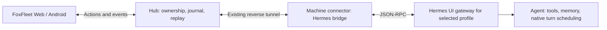
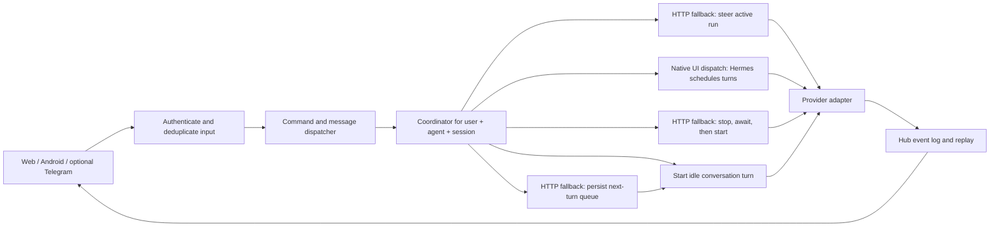

# Hermes slash commands and interruptible chat: research and FoxFleet build plan

Researched 9 October 2026. Scope: research and a build plan; application code is unchanged.
FoxFleet inspected at commit `f6be528b8dd2cce321e90ca31f46aeba0a0892d3`.
Upstream sources below refer to the current Hermes documentation and `main`, which can change.
This is source-level research, without a live Hermes, Telegram, or Discord integration test.

FoxFleet can provide both requested experiences: clickable slash-command choices and a composer
that accepts messages while an agent works. For the fuller Telegram/Discord experience, prefer
Hermes's native UI gateway JSON-RPC protocol. Reuse FoxFleet's connector, authentication, and
event replay; add native session controls and interactive cards. The HTTP run API described
below remains a fallback for installations that expose only the API server.

“Grokbot” is ambiguous. The provider comparison below covers FoxFleet's existing `grok`/xAI
connection. A separate bot or agent harness needs its own capability check.

## Why Telegram and Discord feel integrated

Hermes runs a persistent messaging gateway. Platform adapters translate incoming updates into
shared messages, then the gateway handles authorization, session routing, command dispatch,
and the agent lifecycle. Replies return through the adapter. SQLite retains conversation
history, and routing distinguishes profiles, chats, users, and threads.
[Source: gateway internals](https://hermes-agent.nousresearch.com/docs/developer-guide/gateway-internals/).

The platform adapters also implement the platform's interaction widgets. Telegram uses its
command menu and callback buttons. Discord registers native application commands, including
skills, and its model picker uses provider and model dropdowns. Discord supports attachments
and configurable tool progress messages, making agent work visible in the conversation.
[Source: Discord integration](https://hermes-agent.nousresearch.com/docs/user-guide/messaging/discord/).

These are three cooperating layers: a native platform UI, a session and interaction dispatcher,
and the full agent runtime. FoxFleet currently exposes less of that runtime through its chat
transport. Matching the experience requires connecting controls and feedback as well as text.

## How Hermes builds the menus

Hermes defines commands in `hermes_cli/commands.py` using `CommandDef` and `COMMAND_REGISTRY`.
Definitions include names, aliases, descriptions, categories, argument hints, subcommands,
surface availability, and behavior while busy. Recognized commands can dispatch, reject, or
interrupt before dispatch. Help and completion derive from that registry.
[Source: command registry](https://github.com/NousResearch/hermes-agent/blob/main/hermes_cli/commands.py).

Three UI mechanisms matter:

| What the user sees | How it works | What FoxFleet should build |
| --- | --- | --- |
| A list after typing `/` in Telegram | Telegram displays registered `BotCommand` entries | A searchable command list in the composer |
| Choices after selecting a command, such as `/busy ` | The application supplies argument choices | A second menu generated from `subcommands` |
| Buttons attached to a bot reply, such as choosing a provider and then a model | Inline keyboard buttons send callback queries | An optional action card or model picker |

Telegram's registered command list is flat. `setMyCommands` supplies names and descriptions;
nested choices require application logic. Message buttons use `InlineKeyboardMarkup` and
`callback_data`, and clicks arrive as `CallbackQuery` updates. The command list supports at most
100 entries; callback data is limited to 64 bytes.
[Source: Telegram Bot API](https://core.telegram.org/bots/api#setmycommands).

In current Hermes, `hermes_cli/commands_platforms.py` builds the Telegram menu from eligible
built-ins, plugins, and skills, handles Telegram-compatible names and collisions, and applies
priority before truncation. Its configured default is 60 visible commands.
[Source: platform menu builder](https://github.com/NousResearch/hermes-agent/blob/main/hermes_cli/commands_platforms.py).

The Telegram adapter registers the menu with `set_my_commands`. Its model picker builds
provider/model keyboards, remembers selection state, handles pagination and Back/Cancel,
and acknowledges callback queries. The current file is `plugins/platforms/telegram/adapter.py`;
older guides reference `gateway/platforms/telegram.py`.
[Source: Telegram adapter](https://github.com/NousResearch/hermes-agent/blob/main/plugins/platforms/telegram/adapter.py).

The native `/` menu and the reply-button picker are deterministic application features. They
do not require an LLM to invent choices or interpret button clicks.

## How messages arrive while the agent works

`BasePlatformAdapter.handle_message()` returns quickly and starts background processing, so
receiving the next message does not wait for the agent's answer.
[Source: platform adapter base](https://github.com/NousResearch/hermes-agent/blob/main/gateway/platforms/base.py).

Hermes exposes three busy-input modes, configured through `/busy`:

| Mode | Meaning |
| --- | --- |
| `queue` | Keep the message for a subsequent turn |
| `steer` | Add guidance to the active run without stopping it |
| `interrupt` | Redirect or interrupt the active work with the new message |

The gateway's default is `interrupt`. Configuration uses `display.busy_input_mode` or
`HERMES_GATEWAY_BUSY_INPUT_MODE`; legacy settings can affect the result.
[Source: gateway configuration loaders](https://github.com/NousResearch/hermes-agent/blob/main/gateway/run_config_loaders.py).

The inbound path checks active session state and routes new messages according to that mode.
Steering can fall back to queuing. Ordinary interrupt-mode messages can also become queued
when subagents or context compression are active.
[Source: inbound dispatcher](https://github.com/NousResearch/hermes-agent/blob/main/gateway/run_inbound.py).

In the current agent runtime, `redirect()` can cancel an in-flight model request and keep the
conversation context. During tool execution it degrades to steering, allowing the tool to
finish. `steer()` buffers guidance for a later delivery boundary. An ordinary correction and
an explicit Stop therefore have different semantics.
[Source: agent interrupt controls](https://github.com/NousResearch/hermes-agent/blob/main/agent/interrupt_control.py).

Gateway slash commands have their own busy dispatch path. `/queue`, `/steer`, and `/stop`
are control operations. The gateway also fans steering out to active children; the HTTP
steer handler invokes the run's agent directly. Do not assume identical subagent behavior
between Telegram and the API.
[Source: busy-session coordinator](https://github.com/NousResearch/hermes-agent/blob/main/gateway/run_busy.py),
[source: HTTP run handlers](https://github.com/NousResearch/hermes-agent/blob/main/gateway/platforms/api_server_runs.py).

## Preferred integration for the full experience: native UI gateway

Hermes explicitly recommends its TUI gateway JSON-RPC protocol for custom web and desktop
hosts needing sessions, slash commands, approvals, and fine-grained streaming. It works over
stdio or WebSocket and drives the same agent core as the other integration protocols.

| FoxFleet feature | Native operation |
| --- | --- |
| Discover executable commands | `commands.catalog`, `command.resolve` |
| Execute a slash command | `command.dispatch` |
| Submit a conversation message | `prompt.submit` |
| Guide or stop active work | `session.steer`, `session.interrupt` |
| Discover model choices | `model.options` |
| Reattach and restore state | `session.resume`, `session.activate`, `session.events.since` |

[Source: programmatic integration](https://hermes-agent.nousresearch.com/docs/developer-guide/programmatic-integration).

The native busy-submit path already handles queue, steer, and interrupt modes. A correction
can redirect the active turn; payloads that cannot be steered may queue. FoxFleet should
report the actual acknowledgement rather than predicting which path ran. Let Hermes schedule
accepted turns; do not also drain a duplicate hub queue for those same messages.
[Source: native busy-submit coordinator](https://github.com/NousResearch/hermes-agent/blob/main/tui_gateway/session_auto_continue.py).

Approvals and clarification questions are server-to-client JSON-RPC **requests**, carrying an
ID. Render them as cards and send a response with the same ID. After readiness, advertise
`client.capabilities` with `server_requests: true` once the bridge handles this path. Unsupported
request kinds must receive an error instead of waiting indefinitely. A `request.cancel`
notification removes the matching card; unanswered requests return in reconnect snapshots.
[Source: server request protocol](https://github.com/NousResearch/hermes-agent/blob/main/tui_gateway/server_requests.py).

Restore history together with `inflight`, `queued`, and `open_requests` from native snapshots.
The partial answer, pending question, and run status are essential reconnect state, beyond
simply replaying tokens. Keep their upstream identities when normalizing the hub stream.
[Source: native session snapshots](https://github.com/NousResearch/hermes-agent/blob/main/tui_gateway/server.py).

### Proposed FoxFleet bridge

Use a hub adapter to validate actions, map session IDs, persist submission status, translate
events, and fan updates out to devices. The machine connector owns the local transport and
keeps credentials on the machine. The clients render command menus, tool cards, approval
questions, and conversation state from that common contract.

There are two deployment candidates to validate on the installed Hermes version:

- Attach to an existing authenticated dashboard gateway over WebSocket when its profile and
  identity match. The upstream dashboard uses `/api/ws`; its handshake has a separate auth
  path, and profile-scoped chats may spawn a different gateway. A working dashboard HTTP
  proxy alone does not prove this attach will work for every profile.
  [Source: dashboard gateway attachment](https://github.com/NousResearch/hermes-agent/blob/main/hermes_cli/web_server_chat.py).
- Have the connector own a long-lived stdio gateway in the selected Hermes environment and
  profile. This needs connector lifecycle support; the present connector does not already
  implement a Hermes subprocess bridge.

Keep one runtime owner per active session. Reattaching a browser or phone must subscribe to
that owner rather than start another agent. Native transport membership adds subscribers
without replacing the existing viewer. FoxFleet must enforce account ownership before attach;
upstream transport membership itself only logs a foreign-login attachment.
[Source: shared-session transports](https://github.com/NousResearch/hermes-agent/blob/main/tui_gateway/session_transports.py).

Independent gateway processes cannot jointly own one live session. Durable transcripts do
not guarantee prompt admission survives owner restart.
[Source: programmatic integration](https://hermes-agent.nousresearch.com/docs/developer-guide/programmatic-integration).

Consequently, persist a FoxFleet admission journal with the hub message ID, profile, durable
session key, live runtime ID, upstream acknowledgement, and observed transcript/event IDs.
After a lost acknowledgement or owner restart, reconcile before resubmitting; never promise
exactly-once execution from a local journal alone. Keep uncertain messages visible.

Exposing the protocol also exposes administrative operations. The hub must allow only the
methods and commands authorized for that account/profile. It should not relay arbitrary
RPC frames such as `cli.exec` from a browser. Initially support chat, session lifecycle,
command dispatch under an allowlist, model choices, approvals, and clarification.

This bridge provides comparable controls inside FoxFleet. It does not automatically merge
FoxFleet's live sessions with sessions owned by Hermes's separate Telegram/Discord gateway.
Cross-channel sharing needs an explicit ownership, routing, and handoff design.

## HTTP run API fallback

Current Hermes advertises these native features through `GET /v1/capabilities`:
`run_submission`, `run_status`, `run_events_sse`, `run_steer`, and `run_stop`.
Detect them on the connected profile rather than assuming every installed version supports them.
[Source: API capabilities](https://github.com/NousResearch/hermes-agent/blob/main/gateway/platforms/api_server.py).

| Upstream operation | Endpoint |
| --- | --- |
| Start a run and receive its ID | `POST /v1/runs` |
| Inspect status | `GET /v1/runs/{id}` |
| Follow structured events | `GET /v1/runs/{id}/events` |
| Add guidance | `POST /v1/runs/{id}/steer` with `{"input":"Use PostgreSQL instead"}` |
| Request cancellation | `POST /v1/runs/{id}/stop` |

Run creation returns HTTP 202. Events include `message.delta`, `message.interim`, tool events,
and terminal run events. Steering rejects non-running states with 409. Stop returns a
`stopping` state before cancellation finishes.
[Source: native run implementation](https://github.com/NousResearch/hermes-agent/blob/main/gateway/platforms/api_server_runs.py).

An accepted steer means buffered guidance, not confirmed consumption. A terminal response
can return undelivered `pending_steer`; the frontend must retain it for a following turn.
[Source: programmatic integration](https://hermes-agent.nousresearch.com/docs/developer-guide/programmatic-integration).

Use an existing `session_id` without resending an explicit history when Hermes should load its
own transcript. Creation supports `Idempotency-Key`; event replay supports a cursor. Stop is
cooperative, and controls are scoped to the profile that created the run.
[Source: API server guide](https://hermes-agent.nousresearch.com/docs/user-guide/features/api-server).

Sending the string `/steer ...` through `/v1/chat/completions` does not call the native run
control endpoint. Likewise, a command's existence in the Telegram registry does not establish
that the same command executes through FoxFleet's HTTP chat transport.

## What FoxFleet already has and what is missing

| Area | Evidence in this repository | Required change |
| --- | --- | --- |
| Shared catalog | [Generator](../design/tools/gen-hermes-commands.py) produces hub, web, and Android JSON, including `subcommands` | Preserve argument and execution metadata through each client |
| Web completion | [commands.ts](../web/src/lib/commands.ts) stops suggesting as soon as input contains whitespace | Complete the current argument token and resolve aliases |
| Web menus | [Composer.tsx](../web/src/chat/Composer.tsx) uses the bundled catalog and shows at most eight suggestions | Load the agent-specific catalog; add submenu and full-list navigation |
| Android completion | [Commands.kt](../android/app/src/main/java/dev/foxfleet/app/ui/chat/Commands.kt) flattens definitions into suggestions and ignores `subcommands` | Keep definitions and add the same argument menu behavior |
| Busy composer | Web `canSend` requires `!streaming`; [ChatScreen.kt](../android/app/src/main/java/dev/foxfleet/app/ui/screens/ChatScreen.kt) has the same restriction | Keep Send available during a run, alongside Stop |
| Web sending | [store.ts](../web/src/chat/store.ts) returns immediately when already streaming | Dispatch busy input through a coordinator and guard callbacks by run/session |
| Upstream chat | [index.js](../server/index.js) uses Hermes `/v1/chat/completions`; `/commands` returns the bundled list | Add the native Hermes UI bridge, live catalog, and explicit command dispatch |
| Run lifecycle | [runs.js](../server/runs.js) buffers SSE and detaches disconnected clients; Stop aborts upstream HTTP | Track native upstream IDs and acknowledgements; add session coordination |

The catalog currently marks `/steer` and `/queue` as `chat`, while `/busy` is unavailable because
it needs a terminal. These labels describe the generated catalog, not proven command execution
over the connected transport. Use the live catalog and verified native operations where
available; keep local FoxFleet controls explicit.

## Proposed behavior

Typing `/` opens the command list. Selecting `/busy` opens `queue`, `steer`, `interrupt`, and
`status`. Typing `/busy st` filters to `steer` and `status`. Static choices come from catalog
metadata; a model picker fetches current provider/model options. Choosing a command with
required text keeps focus in the composer.

While an agent runs, keep the text field, Send, and Stop available. Show a small Send mode
selector: **Steer**, **Queue**, or **Interrupt & send**, restricted to supported actions.
For the Telegram-style default requested here, choose Interrupt & send; offer Steer for
corrections that should preserve ongoing tool work. Verify the native mode-setting scope before
offering a per-conversation setting: do not silently change another session's profile default.

For Hermes's HTTP adapter, Interrupt & send means an explicit stop request followed by a new
run after termination. This is stronger than Telegram's newer active-turn redirect. Label the
behavior clearly. The preferred native UI protocol can route a busy prompt to active-turn
redirect instead. Do not silently substitute Stop for Steer.

Persist incoming messages before acknowledging them. Display whether each is queued, accepted
as guidance, or awaiting cancellation. “Guidance accepted” must not become “Guidance consumed”
without evidence. Recover undelivered guidance after a terminal event.

Admission, ownership, and the journal live on the hub so two browser tabs and a phone share
one policy. Native turn scheduling stays in Hermes; HTTP fallback scheduling stays in the
hub. Control requests must remain responsive while the worker runs; do not hold a session
lock across the entire agent execution.

## Build order

### 1. Establish a truthful capability and command contract

First prove one end-to-end native UI connection through the connector: create/resume a
session, submit a message, send a correction during work, answer a clarification/approval,
and reconnect without launching a duplicate turn. Validate authentication, profile selection,
and the installed protocol version before expanding the UI.

Extend agent capabilities with supported busy modes, interactive request types, command
dispatch, and reconnect support. Probe Hermes through [hermes.js](../server/hermes.js), using
the saved profile and the existing connector; negotiate the native gateway capabilities.
Retain the generated catalog as an offline fallback, but filter executable commands by adapter
support. Add an explicit handler/action field and busy policy to the hub catalog.

Route `/stop`, `/queue`, `/steer`, and `/busy` through verified adapter operations. Keep free-text skill
invocations distinct from administrative commands. Commands without a verified execution
route should be disabled with a useful reason. For the UI protocol, use `model.options` and
native command dispatch for `/model`; check busy restrictions and successful mutation.
For an HTTP-only connection, verify its model mutation route separately.

### 2. Add command submenus to both clients

Extend web and Android suggestion models to retain definitions, aliases, and subcommands.
Parse command name, argument position, and current token. Preserve free-text arguments and
existing `#` skills. Add mouse/touch selection, keyboard navigation, Escape/Back, and an
accessible scrollable list. Feed the web composer the hub catalog already exposed by
[client.ts](../web/src/api/client.ts).

This stage can ship independently for commands that already execute locally.

### 3. Bridge native sessions, events, and interactive requests

Implement the UI protocol adapter with correlation IDs for client calls and server questions.
Translate structured events and snapshots into a versioned FoxFleet contract. Keep session,
turn, message, tool, and request identities distinct. Add approval and clarification cards
to both clients; persist their current state and clear only the matching cancelled request.
Do not advertise handlers that cannot return a valid response.

For the HTTP fallback, use the native run API when capability detection permits it. Keep a hub run ID mapped to the
upstream run ID, profile, session, and cursor. Normalize structured upstream events into a
stable FoxFleet stream instead of passing them to the current OpenAI-chunk parser unchanged.
Keep commentary distinct from final output and honor `already_streamed` to avoid duplicate text.

Make explicit Stop invoke upstream Stop and report `stopping` until termination is confirmed.
Closing a browser stream remains a detach operation. Preserve replay, errors, and session
continuity. Add a bounded recovery path when the upstream event log has truncated.

### 4. Add hub admission and recovery; schedule HTTP fallbacks

Introduce stable message IDs and an admission journal for each `(user, agent, session)`.
Persist submissions and run mappings before acknowledgement; use idempotent admission for
retryable creates where upstream supports it. A short admission lock orders requests, while
a separate control path reaches the active session immediately. For UI-protocol sessions,
delegate busy input to Hermes and mirror acknowledgements and queue state. Reconcile uncertain
submissions after reconnect or owner restart instead of blindly repeating them.

For HTTP-only adapters, maintain a bounded FIFO queue. Steer calls the adapter's control
operation. Queue schedules the next turn. Interrupt & send
requests Stop, waits for confirmed termination, then starts the replacement in the same
conversation. A failed Stop leaves the replacement pending with a visible error. Additional
messages arriving during cancellation stay ordered rather than launching parallel writers.
Stop alone halts automatic queue draining until an explicit resume or new submission.

### 5. Enable sending during runs on web and Android

Update the composers, chat stores, API clients, and stream handling together. Do not merely
remove `!streaming`: the current web sender commits a captured history snapshot, which can
overwrite newly appended messages. Apply stream updates by run/message identity and ignore
callbacks belonging to a different session or obsolete run.

Preserve partial assistant output with an interrupted status, submitted messages, attachment
references, and unsent drafts. Restore queue and mode state after navigation, reconnection,
or a hub restart. If a run is waiting for a question, use the native adapter's supported busy
behavior and keep the answer card available. The HTTP adapter cannot steer every waiting state.

### 6. Support other providers honestly

| Connection | Initial supported behavior |
| --- | --- |
| Hermes native UI protocol | Native command dispatch, queue/steer/redirect busy input, Stop, interactive questions, session restoration |
| Hermes HTTP native run controls | Queue, native Steer, Stop, and stop-then-start interruption |
| Older Hermes | Queue; transport-abort interruption only after validating that version's behavior |
| FoxFleet Grok/OpenAI-compatible providers | Queue and abort/resubmit using updated history |
| MCP inbox | Message delivery; no runtime interruption without an acknowledgement protocol |

xAI documents streamed chat completions. FoxFleet's existing Grok adapter uses that request
model. The abort/resubmit behavior above is a FoxFleet orchestration proposal, not a claim
that xAI accepts Hermes-style mid-request steering or guarantees remote computation stops
when an HTTP stream closes.
[Source: xAI streaming documentation](https://docs.x.ai/developers/model-capabilities/text/streaming).

### 7. Add actual Telegram and Discord channels if desired

Reuse the hub dispatcher, permissions, queue, and adapters. Register the command list; build
reply-button submenus only where they help. Acknowledge inbound updates promptly, deduplicate
update IDs, and bind callback actions to the user and conversation that opened the picker.
Keep long-running work separate from receiving updates. This is a later channel integration,
not a prerequisite for the web/Android UX.

For Discord, register application commands and use buttons/dropdowns for action cards.
Receive message and interaction events independently of agent execution, acknowledge
interactions promptly, and preserve channel/thread/user scope. Route both channels through
the same hub ownership and native bridge so they operate on the intended live session.
Hermes's existing messaging gateway remains a separate deployment unless an explicit
cross-channel handoff or adapter integration is built.

## Validation required before release

Extend the existing command, composer, run, and contract tests with observable behaviors:

- `/busy ` opens choices; `/busy st` filters correctly; aliases and free-text skill arguments work.
- A message sent while busy reaches the hub and remains visible while the existing reply streams.
- Native busy input reports whether it was steered, redirected, or queued; tool execution and
  non-steerable attachments follow the native result rather than a frontend prediction.
- Queued messages retain order across reconnects and two devices; owner/hub restart reconciles
  the journal without silently losing input or blindly launching duplicate turns.
- Approval and clarification requests render, respond once, cancel by ID, and return after reconnect.
- A second device attaches to the same live owner; its disconnect does not cancel another viewer's run.
- A late accepted steer returned as `pending_steer` survives and is replayed once; 409 responses
  preserve the submitted text.
- Interrupt & send waits for termination; failed cancellation never launches a second writer.
- Stop during run creation, tool execution, or approval waiting produces a truthful state.
- Old stream callbacks cannot overwrite the active session or duplicate partial/final text.
- Wrong-user/profile controls fail; unsupported commands and Steer remain unavailable.
- Detaching a client keeps work alive, with cursor replay and truncation recovery intact.

Follow with a live Hermes UI-protocol check through the connector and an HTTP fallback check,
Telegram/Discord menu and callback smoke tests if those adapters are built, and a Grok stream cancellation/resubmit
check. Documentation and source inspection alone do not establish those runtime guarantees.
