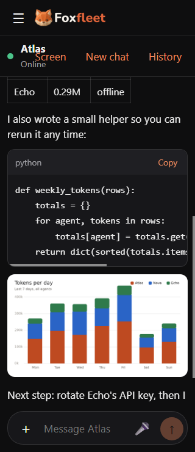
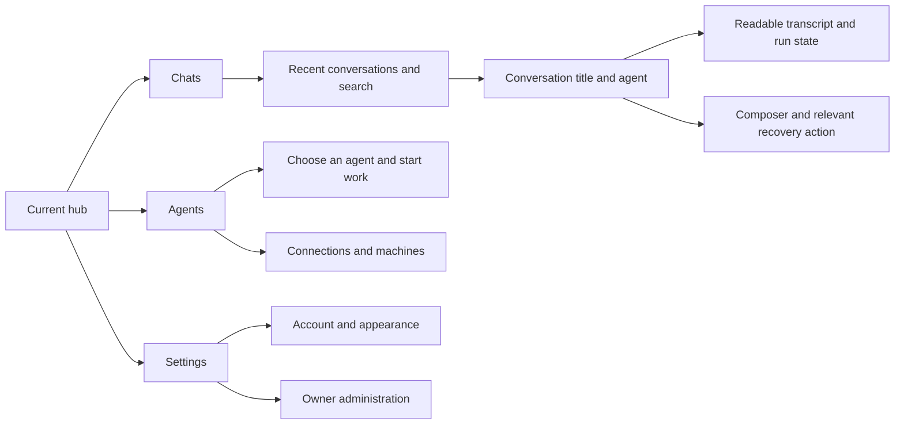

# FoxFleet UI design research and audit

Reviewed 9 October 2026 (Asia/Saigon), against repository version `0.2.1-alpha`.

FoxFleet has a coherent visual foundation and a capable chat implementation. Its largest design opportunity is helping people find and resume their work. The current interface makes an agent easy to select, but makes a particular conversation harder to recognize, retrieve, and monitor.

Recommended product principle: **one calm place to continue work with your agents**. Keep the existing fox identity, restrained palette, readable answers, and capability-aware controls. Make conversation context, progress, and recovery as dependable as the composer.

## Scope and evidence

This audit combines official product/design publications, local source inspection, existing Android screenshots, and browser inspection of a freshly built web app using the repository's mock hub. Browser checks used isolated demo accounts and data, with desktop `1280 × 800`, phone `390 × 844`, and narrow phone `320 × 740` viewports. Screenshots and observations are in [images/ui-audit](images/ui-audit/observations.json).

Evidence labels below distinguish **browser-confirmed**, **source-confirmed**, **calculated**, and **design hypothesis**. Priorities are recommendations: P1 addresses lost context, blocked work, misleading feedback, or substantial accessibility barriers; P2 improves discoverability and consistency. They are not measured customer-impact scores.

Android observations are based on Compose source and existing screenshots. No physical-device, keyboard/IME, TalkBack, or Android process-death testing was performed. Browser viewport emulation does not validate a real phone's keyboard or touch behavior. Competitor articles document particular design decisions; they are not an exhaustive inventory of October 2026 interfaces or proof that UI alone caused those products' success.

## What successful messaging designs teach us

| Product and primary source | Documented design decision | Interpretation for FoxFleet |
| --- | --- | --- |
| [WhatsApp: chat filters](https://about.fb.com/news/2024/04/whatsapp-chat-filters/) — April 2024 | Added visible All, Unread, and Groups filters to reduce inbox scrolling. | Make returning to the right work easy. Conversation previews, recency, and unread state are useful information; reducing every row to an agent name removes context. |
| [Telegram: folders and archive](https://telegram.org/blog/folders) — March 2020 | Introduced folders when the list becomes cluttered, pins within folders, archive, and synchronization across clients. | Start with a small, comprehensible conversation list. Add organization as usage grows. Search and a few pins are a more immediate need than elaborate folders. |
| [Signal: message requests](https://signal.org/blog/message-requests/) — August 2020; [reactions](https://signal.org/blog/reactions/) — February 2020 | Shows identity before accepting an unfamiliar conversation; reactions enable lightweight responses while limiting group notification noise. | Identity and control should be visible at the moment they matter. For agents, that means a recognizable name, purpose, and clear execution state. Reactions are a lower priority than reliable agent status and recovery. |
| [Slack: designing with customers](https://slack.com/blog/collaboration/designing-the-future-of-slack-with-customers) — March 2020; [focus redesign](https://slack.com/blog/productivity/a-redesigned-slack-built-for-focus) — August 2023 | Reduced confusing choices, tested navigation with beginners, and organized attention through Home, Activity, and Later. Some visually tidy prototypes hid context people needed. | Minimalism should reduce decisions while preserving useful information. Let conversation dominate, reveal technical detail on demand, and make unfinished work easy to return to. Test task completion before choosing a cleaner-looking layout. |
| [Discord: responding to mobile feedback](https://discord.com/blog/refining-discords-mobile-experience-with-your-feedback) — May 2024 | Recombined Servers and Messages after feedback that separation made switching between desktop and mobile confusing; improved search discoverability. | Keep the same concepts, names, and state meanings across web and Android. Native layouts can differ without requiring users to relearn where their work lives. |

The common design logic is a short, predictable loop: **find the conversation → understand the context → write → see what happened → return later**. This is a synthesis of the sources, not a measured explanation of market success. Reliability, distribution, network effects, and switching costs also affect adoption.

For FoxFleet, a conversation is a task that can continue for minutes or hours. Human-messenger conventions need adaptation: an agent being online does not imply that it accepted a task, and the hub accepting a request does not imply that the agent completed it.

## Design philosophy for FoxFleet

1. **Show work before infrastructure.** Use conversation titles and recent activity in daily navigation. Put connection setup, machines, and credentials in an accessible management area.
2. **Preserve context through interruptions.** Returning from another agent, a reload, or an interrupted connection should recover the intended conversation. Its title and state should agree with its URL.
3. **Be explicit about progress.** Separate availability, request acceptance, agent execution, completion, failure, and stopping. Use actual protocol events; avoid decorative progress percentages or simulated delivery receipts.
4. **Keep the next action obvious.** The composer, Stop, and recovery action should be easy to find. Place history, tools, and configuration where their frequency and purpose justify them.
5. **Reveal complexity when it helps.** Collapsed reasoning and tool details already follow this principle. A compact summary should communicate what happened before the user opens technical details.
6. **Build recognition across platforms.** Share names, semantic states, visual identity, and conversation behavior. Respect platform conventions for drawers, sheets, keyboard navigation, touch, and Back.
7. **Use motion to explain changes.** Preserve reduced-motion support. Motion should communicate insertion, completion, or navigation without delaying reading or becoming the only indication of activity.

## Existing strengths to preserve

| Area | Evidence and value |
| --- | --- |
| Visual identity | [Shared tokens](../design/tokens.json) define light/dark surfaces, accents, type, spacing, radii, and motion. The fox brand is distinctive without occupying the answer area. |
| Reading | [Web messages](../web/src/chat/Message.tsx) support Markdown, tables, code copying, images, timestamps, and collapsed reasoning/tool steps. The restrained answer layout is suited to longer agent responses. |
| Composer | [Web composer](../web/src/chat/Composer.tsx) supports attachments, previews, upload progress, voice where available, command suggestions, and a visible Stop action. Controls follow agent capabilities. |
| Continuity | [Web chat store](../web/src/chat/store.ts) and [Android chat state](../android/app/src/main/java/dev/foxfleet/app/ui/chat/ChatState.kt) support remembered sessions and resumable runs. [Web drafts](../web/src/chat/drafts.ts) preserve unsent text per user, agent, and session. |
| Accessibility groundwork | Skip link, focus styles, keyboard history navigation, reduced-motion settings, and bounded reply announcements already exist. These are useful foundations, with validation gaps described below. |
| Agent control | [Screen takeover](../web/src/screen/ScreenView.tsx) communicates view-only versus user control, provides hand-back, and displays a countdown. This is a strong example of making a consequential state explicit. |
| Setup and management | Address validation, pairing, connection testing, write-only secret hints, and forms based on the hub registry make technical setup understandable for the intended self-hosting audience. |

## Prioritized findings

### A01 — P1: Conversations are difficult to discover

**Source-confirmed structure; design hypothesis about user impact.** The [web shell](../web/src/screens/Shell.tsx) lists agents, with earlier conversations in the [History menu](../web/src/chat/SessionsMenu.tsx). Android starts with agent cards and offers both recent sessions inside the chat drawer and a [History sheet](../android/app/src/main/java/dev/foxfleet/app/ui/screens/HistorySheet.kt). Neither primary list exposes conversation previews or a conversation search field.

A person who remembers “the release notes” must first remember which agent handled them. The interface also gives little indication that an agent has several distinct conversations.

**Recommendation:** Surface recent conversations with title, agent identity, preview, and updated time. Keep the agent directory for starting work and inspecting availability. Put search directly in history as an incremental first step: the [web API client](../web/src/api/client.ts) already accepts a sessions `q` parameter, and [hub-side API-agent history](../server/history.js) searches titles and message content. Cross-agent search needs aggregation and provider-specific coverage; it is not already implemented as a unified inbox.

**Acceptance:** A participant can find a known conversation by topic without remembering its agent. Test with multiple agents and at least 30 conversations, including duplicate titles.

### A02 — P1: The session URL and displayed conversation can disagree

**Browser-confirmed.** After opening `sess_a2`, changing the URL to `#/chat?agent=atlas&session=sess_a1` leaves `sess_a2` selected in History. [ChatView](../web/src/chat/ChatView.tsx) restores on the agent dependency; the same-agent session parameter change does not trigger that effect. Restoration also needs to handle existing in-memory state deliberately.

**Recommendation:** Make agent and session jointly determine the active conversation. Preserve run continuation and drafts while handling URL changes, Back/Forward, and explicit selection.

**Acceptance:** Same-agent session links, reload, Back/Forward, and History selection consistently open the intended transcript. Cover changes while a run is active and rapid successive selections.

### A03 — P1: The narrow header overlaps its own controls

**Browser-confirmed.** At `320px` width with the app's Large text setting, the agent name overlaps the Screen button. The browser reports no horizontal page overflow, so checking only overflow misses this defect. At `390px`, the branding bar and chat header together occupy `116px` before the transcript begins.

**Recommendation:** Give agent identity a protected width and a controlled ellipsis. Move secondary actions into an accessible overflow menu when space is constrained. Evaluate consolidating the two mobile header rows.

**Acceptance:** Identity, state, and actions do not overlap at narrow widths, with long names and increased text size. Validate real-device keyboard opening and landscape separately.

### A04 — P1: History refresh failures have no visible explanation

**Browser-confirmed.** Blocking the Atlas sessions request leaves the previously loaded four rows visible and shows no error alert. [loadSessions](../web/src/chat/store.ts) catches the error and resolves, so the caller's `.catch(failHistory)` does not receive it. Initial session-list failures can also be converted to an empty list.

**Recommendation:** Represent history loading, stale data, empty results, and load failure separately. Retain useful rows, but say “Couldn't refresh history” and offer Retry. Clear the error after a successful refresh.

**Acceptance:** A failed initial load cannot look like “no earlier conversations”; a failed refresh or pagination request explains the problem without discarding existing history.

### A05 — P1: Recovery and execution status require too much interpretation

**Source-confirmed.** Chat errors render text in both clients. Retry exists through `/retry`, but the normal error surface has no visible Retry action. The web user-message model has no request-delivery state; availability is largely expressed as Online/Offline, while Android also distinguishes Ready. Resumable runs exist already, but that capability is not a complete user-visible progress model.

**Recommendation:** Add an appropriate visible action for each failure: reconnect to the hub, reload history, resume an existing run, or retry a rejected request. Display acceptance/execution state from real events. For mailbox agents, show that a request is waiting for collection when supported by the protocol.

**Acceptance:** A participant can explain whether their request was accepted, is still running, completed, or failed, and can recover without knowing a slash command. A connection interruption must not silently send a second copy of a task that may already be running. Distinguish regeneration from safe resumption.

### A06 — P1: Faint text falls below the intended contrast target

**Calculated and source-confirmed.** `textFaint` has the following contrast against `bg`, `surface`, and `surfaceAlt`, respectively:

| Theme | Background | Surface | Alternate surface |
| --- | ---: | ---: | ---: |
| Light | 2.70:1 | 2.94:1 | 2.49:1 |
| Dark | 3.70:1 | 3.43:1 | 3.15:1 |

The token is used for meaningful small text, including field hints and Android history timestamps/section labels. These pairs are below the usual [WCAG AA normal-text threshold of 4.5:1](https://www.w3.org/WAI/WCAG22/Understanding/contrast-minimum.html). The [existing contrast tests](../web/tests/a11y.test.ts) cover body/muted text and accents, but omit `textFaint`. Light-theme Ready/Online pills also use status colors as small text although tests only require status colors to reach 3:1 against a surface; their final tinted background pairs need checking.

**Recommendation:** Reserve faint color for decorative elements. Use a passing secondary-text token for hints, timestamps, and labels; provide separate semantic colors for status text and dots. Test actual foreground/background combinations.

**Acceptance:** All meaningful text pairs pass their applicable threshold in both themes and every accent. Update [the accessibility checklist](ACCESSIBILITY.md), whose “every text/background pair” statement currently exceeds test coverage.

### A07 — P1: Drawer and attachment-menu keyboard behavior is incomplete

**Browser-confirmed.** With the phone drawer open, pressing Tab from Sign out moves focus to the obscured Screen button. The attachment menu remains open after Escape, and its trigger has no `aria-expanded` state. The History menu already implements a more complete keyboard model.

**Recommendation:** Treat the phone drawer as a modal interaction: move focus inside, keep background content inactive while open, and restore focus on dismissal. Apply explicit open state, Escape/outside dismissal, and focus handling to the attachment menu. Route focus should respond to agent/session changes, not just route names.

**Acceptance:** Keyboard navigation stays in the drawer until dismissal. Attachment actions can be opened, selected, and dismissed predictably, including a canceled file picker. Validate with screen readers. The observed ordinary chat has no `h1`; also reconcile the checklist's “one h1 per view” claim with implementation, without treating an h1 count alone as a complete accessibility assessment.

### A08 — P2: Draft preservation differs between clients

**Source-confirmed; Android behavior needs device validation.** Web text drafts are keyed by user, agent, and session and survive reloads; attachments remain in memory. Android composer text uses a local, unkeyed `rememberSaveable` value, and no equivalent per-conversation draft store appears in the reviewed ViewModel/settings implementation. Saveable local state is not evidence of matching behavior across session switches or app restarts.

**Recommendation:** Define the same draft lifecycle on both clients: switching away preserves the draft for that conversation; switching sessions restores the correct draft; sending clears only the sent draft; sign-out follows a documented local-data policy. Do not promise attachment survival unless implemented.

**Acceptance:** Verify agent/session switches, Back, rotation, and process recreation with two distinct drafts; no draft appears in another conversation or account.

### A09 — P2: Unread state is too limited for a fleet of agents

**Source-confirmed.** Android shows an in-memory unread boolean per agent, set when a reply completes away from the active chat. The web shell has no equivalent unread indicator. These are not persisted, per-conversation, cross-device read positions. The reviewed interfaces also lack a clear “new reply below” affordance when the user is reading older messages.

**Recommendation:** Introduce consistent conversation-level unread/read state and a jump-to-latest control. Make Running, Unread, Failed, and Disconnected distinct. Define hub-side read cursors if state is expected to synchronize across devices. Add opt-in notifications only after these semantics are clear.

**Acceptance:** Finishing a background task makes the correct conversation discoverable. Reading another session with the same agent does not incorrectly clear its unread result. A user reading above the bottom can return to new content without losing their place.

### A10 — P2: An unavailable agent can block access to its history

**Source-confirmed.** Android [FleetScreen](../android/app/src/main/java/dev/foxfleet/app/ui/screens/FleetScreen.kt) disables opening the agent card when `chatReady` is false; the chat drawer similarly gates switching agents. The web interface permits opening the agent and does not use `chatReady` to gate Send in the composer.

**Recommendation:** Separate opening a conversation from submitting a new request. Allow reading history that is available from the hub, and explain when history must be fetched from a disconnected machine. Offer reconnect/setup actions when relevant. Mailbox agents may accept requests even when their worker is not currently online.

**Acceptance:** An offline agent never blocks locally available history. Sending behavior reflects provider capability and actual readiness, with an explanation when unavailable.

### A11 — P2: Answers are readable but difficult to reuse

**Source-confirmed and observed in the browser.** The rendered web answer offers code-block Copy, but no whole-answer Copy, explicit selected-message reply, or save-output action. Those are more relevant to an agent workspace than copying every social messaging feature.

**Recommendation:** Start with accessible whole-answer Copy. Evaluate quoting a selected passage and saving a useful result when research shows a need. Provide equivalent keyboard and touch actions. Treat regenerated replies as a new execution with possible side effects.

**Acceptance:** Users can copy an entire answer, including its useful structure, without manually selecting a long transcript. Actions remain discoverable without hover.

### A12 — P2: First use needs a clearer route to the first useful reply

**Source-confirmed.** Web has “Add your first agent”; Android's empty fleet offers Refresh with “Once an agent connects … it shows up here.” The normal Android management route goes through Settings. New chats say “Say hello” or “Start a conversation,” with little guidance about the agent's purpose.

**Recommendation:** Give owners a direct Connect a machine/Add an agent action in an empty fleet. Give regular users guidance appropriate to their available permissions. Use an agent's description and capabilities to offer a few concrete starter prompts, while keeping free-form input primary.

**Acceptance:** A first-time owner can connect an agent and receive a useful reply without searching Settings. A regular user sees an actionable explanation when no agents are available.

### A13 — P2: Identity and terminology differ across platforms

**Source-confirmed and visually observed.** Android uses avatars, descriptions, badges, readiness pills, and unread dots. Web navigation mainly uses names and availability dots. Android's chat subtitle uses a truncated session ID; web shows availability instead of a conversation title. Android's drawer uses the internal agent name even where other surfaces use the display label. Web actions mix text, Unicode symbols, and emoji.

**Recommendation:** Establish a shared identity pattern: display name, recognizable avatar/initials, purpose, conversation title, and semantic status. Keep technical IDs in details. Use a consistent icon set with labels where needed, and one term for user-facing conversations/history. Retain useful provider/capability details in the agent profile.

**Acceptance:** A renamed agent and a titled conversation are recognizable in navigation, header, history, and accessibility labels on both clients.

## Proposed navigation direction

Treat this as a prototype to validate, not a settled redesign. Preserve quick resumption of the last conversation, and make the conversation list easy to reach from it.

On desktop, prototype Recent conversations and Agents as sidebar sections; keep the composer and transcript prominent. On phones, prototype a full conversation list with a clear return path from chat. Compare visible navigation against the existing drawer before introducing permanent bottom tabs. A conversation row should answer: “Which task is this, which agent handled it, what happened last, and does it need my attention?”

For an agent run, use a compact state summary such as “Request accepted,” “Working,” “Using a tool,” “Completed,” or an actionable error, when those states are known. Run details can open below that summary. Availability belongs with agent identity; execution belongs with the task.

Use larger targets for frequent touch actions: aim for about `44px` on mobile web and `48dp` on Android, while retaining compact desktop layouts where appropriate. The observed web Send target is `38 × 38px` and Android custom icon buttons are `40dp`; that is an ergonomic opportunity, not by itself a proven WCAG failure. [WCAG 2.2 AA target-size guidance](https://www.w3.org/WAI/WCAG22/Understanding/target-size-minimum.html) sets a 24 CSS-pixel minimum with spacing and other exceptions.

## Delivery order and validation

| Stage | Changes | Exit condition |
| --- | --- | --- |
| 1: Dependable current experience | Fix A02–A07: routing, narrow header, error visibility, recovery controls, contrast, keyboard behavior. | URL and transcript agree; failures have correct actions; narrow/large text layout remains usable; keyboard and meaningful text checks pass. |
| 2: Easier return to work | Prototype A01, A09, A13: visible conversations, history search, identity, unread and run state. | Participants retrieve known work and find background completions with fewer wrong turns than in the current interface. |
| 3: Consistent daily use | Address A08, A10–A12: Android drafts, unavailable-agent reading, reusable answers, first-use guidance. | Cross-client scenarios preserve expected context; first-time users reach a useful reply independently. |

These fit alongside the [existing roadmap](roadmap.html), which already marks resumable chats and history as implemented, and lists accessibility validation, device testing, and notifications as unfinished. This audit does not reclassify those capabilities as absent or change roadmap commitments.

Use task-based sessions with a small initial group of first-time and returning users. Compare against the current interface and collect task success, elapsed time, wrong destinations, missed completions, and confusion about request state. Initial proposed goals, to calibrate after measuring the baseline:

- Find a named conversation among 30+ sessions in under 10 seconds.
- Find which task finished while viewing another conversation, without opening every agent.
- Interrupt a connection mid-run and recover without sending a duplicate task.
- Switch two conversations with distinct drafts and return to the correct text.
- Copy a long answer, attach a file, and dismiss menus using keyboard alone.
- Read available history for an agent whose machine is disconnected.
- Complete setup and obtain a useful reply as a new hub owner.

Run physical Android checks with rotation, keyboard opening, large system font, process recreation, and TalkBack. Perform the outstanding web screen-reader pass and axe checks. Automated assertions should cover behavioral regressions such as session routing, failed history loads, focus containment, and actual text contrast; passing token tests alone cannot establish usability.

## Audit validation and captured evidence

The web production build passed. Five targeted suites passed: contrast, history, persistent drafts, History menu keyboard behavior, and resumable runs — **40 tests total**. No application behavior was changed for this audit.

Browser observations reproduced A02, A03, A04, and A07. Source inspection supports the remaining implementation observations; proposed user-impact improvements still need usability research. Mock capabilities differ from the real registry for some API-key agents: the real [provider specs](../server/config.js) enable sessions for those agents, while the mock disables them for some fixtures. Do not infer production history support from those mock rows.

- [Desktop chat, light](images/ui-audit/desktop-chat-light.png)
- [Desktop History menu, light](images/ui-audit/desktop-history-light.png)
- [Phone chat, light](images/ui-audit/phone-chat-light.png)
- [Phone chat, dark](images/ui-audit/phone-chat-dark.png)
- [Phone drawer, light](images/ui-audit/phone-drawer-light.png)
- [Narrow phone with Large text](images/ui-audit/phone-320-large-text.png)
- [Recorded browser observations](images/ui-audit/observations.json)

To reproduce the browser scenarios, build `web`, run `node web/tools/mock-hub.mjs 3099`, and use the demo owner flow. Open an Atlas history entry, then change only the session query in the URL; block `/api/agents/atlas/sessions*` while refreshing History; press Escape after opening Attach; and Tab from Sign out while the mobile drawer is open. For the overlap, use the `320px` viewport and Settings → Text size → Large.
